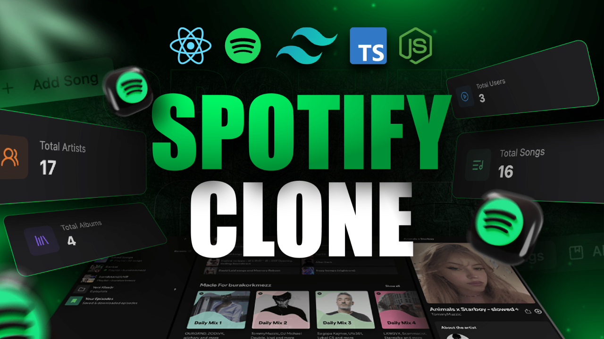

# 🎵 Realtime Spotify Application ✨  

  

## 🚀 Descripción  

Esta aplicación permite escuchar música en tiempo real con múltiples funcionalidades interactivas y administración avanzada.  

### ✨ Características  

- 🎸 **Reproductor de música:** Escucha canciones, avanza y retrocede entre pistas.  
- 🔈 **Control de volumen:** Ajusta el volumen con un control deslizante.  
- 🎧 **Panel de administración:** Crea álbumes y canciones desde un dashboard exclusivo.  
- 💬 **Chat en tiempo real:** Interactúa con otros usuarios mientras escuchas música.  
- 👨🏼‍💼 **Estado en línea/desconectado:** Muestra quién está disponible en el momento.  
- 👀 **Actividad en tiempo real:** Ve qué están escuchando otros usuarios.  
- 📊 **Página de analíticas:** Consulta datos agregados sobre la actividad de los usuarios.  
- 🚀 **Y mucho más...**  

---

## 🛠 Configuración  

Para ejecutar el proyecto correctamente, debes configurar los archivos `.env` tanto en el backend como en el frontend.  

### 📌 Configuración del Backend (`/backend/.env`)  
```bash
PORT=...
MONGODB_URI=...
ADMIN_EMAIL=...
NODE_ENV=...

CLOUDINARY_API_KEY=...
CLOUDINARY_API_SECRET=...
CLOUDINARY_CLOUD_NAME=...


CLERK_PUBLISHABLE_KEY=...
CLERK_SECRET_KEY=...
```

### 📌 Configuración del  .env file en  folder _frontend_

```bash
VITE_CLERK_PUBLISHABLE_KEY=...
```
